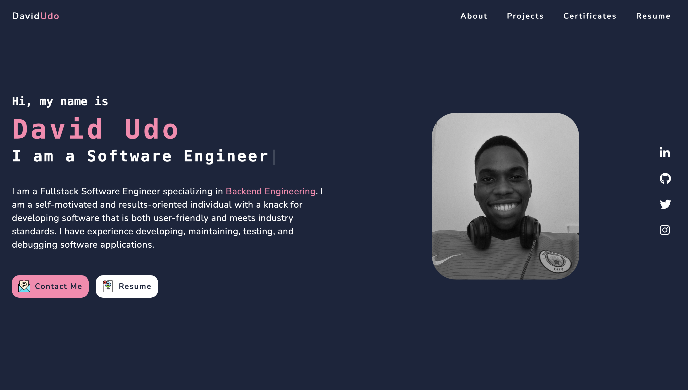
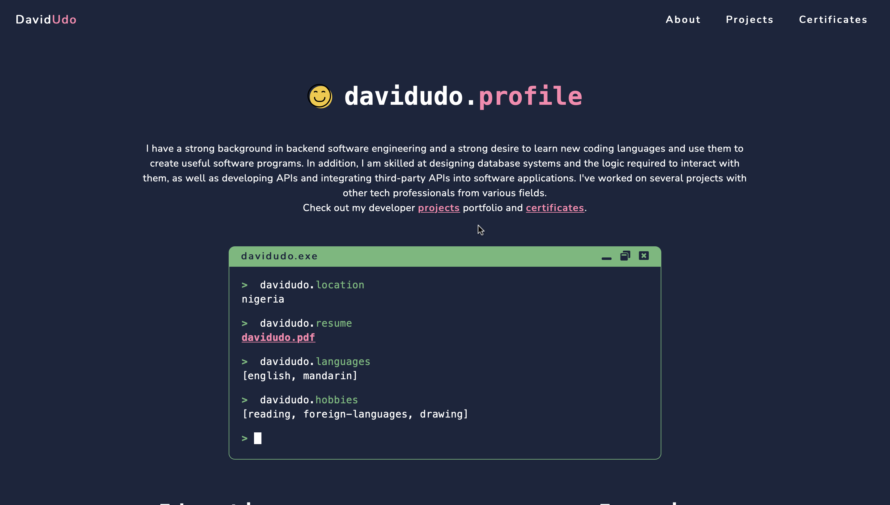
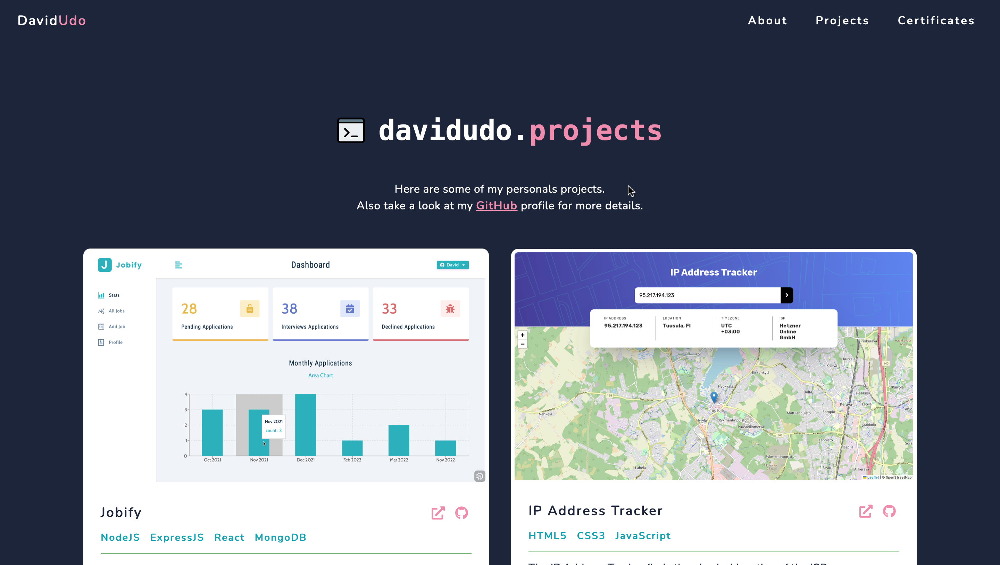
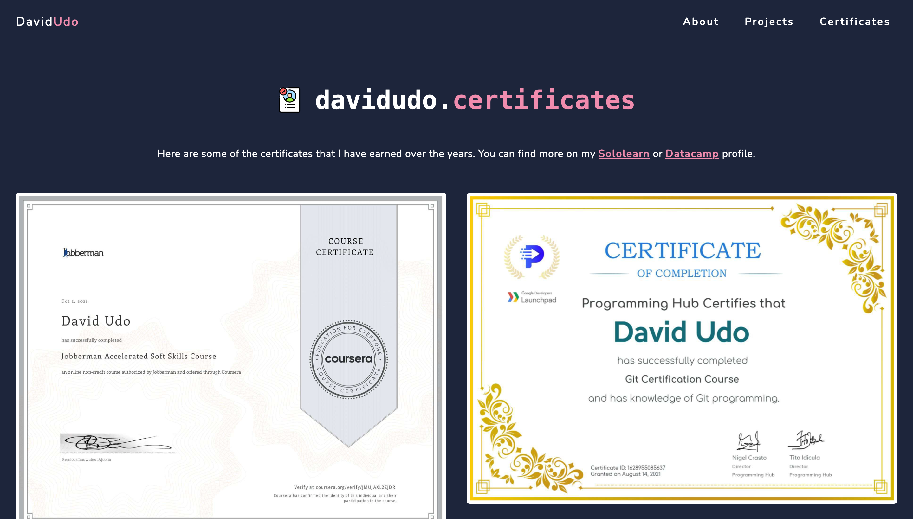

# David Udo Portfolio Website

This is the second portfolio website I have built for myself. The website contains all the information anyone needs to know about me. The website consists the following pages: 
- Home
- About
- Projects
- Certificates

# Screenshot

## Home Page

## About Page

## Projects Page

## Certificates Page

# Links

- Code URL: [https://github.com/davidudo/davidudo_portfolio](https://github.com/davidudo/davidudo_portfolio)
- Live Site URL: [https://davidudo.netlify.app](https://davidudo.netlify.app/)

# Built with

- HTML
- CSS
- JavaScript

# Author

- LinkedIn - [David Udo](https://www.linkedin.com/in/david-udo-1713b3231)
- Twitter - [@_davidudo](https://www.twitter.com/_davidudo)
- Instagram - [@_davidudo](https://instagram.com/_davidudo)
- Email - [udodavid46.ud@gmail.com](mailto:udodavid46.ud@gmail.com)